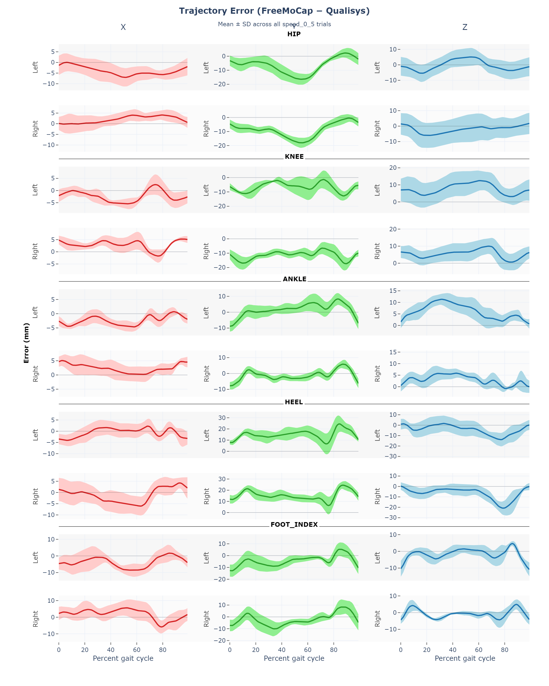
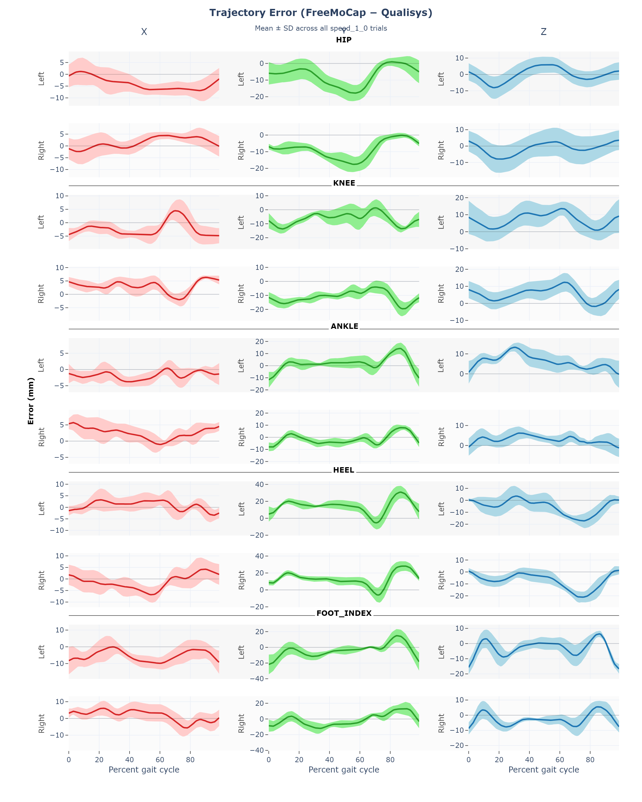
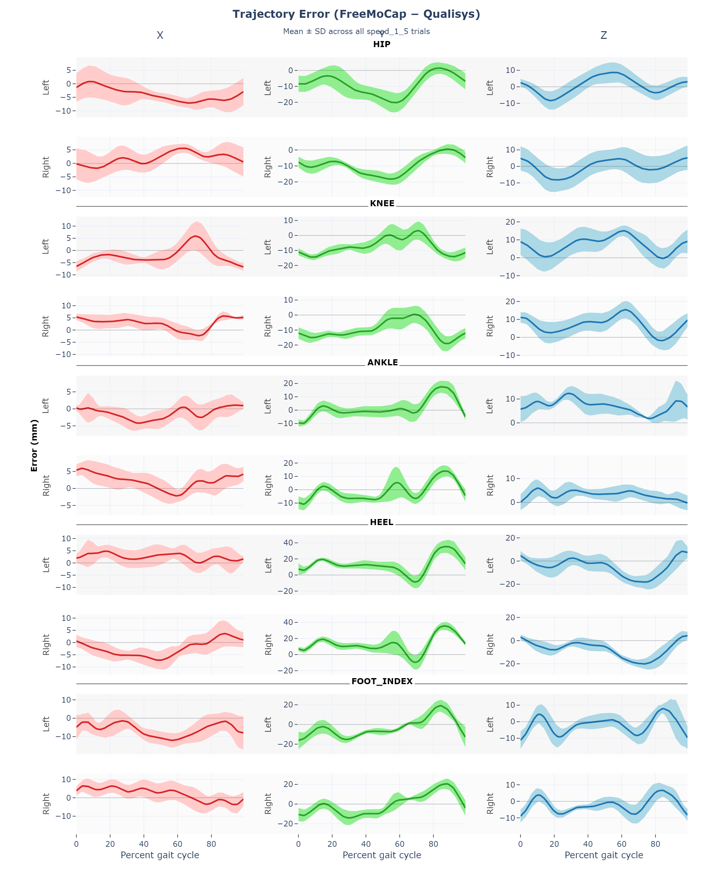
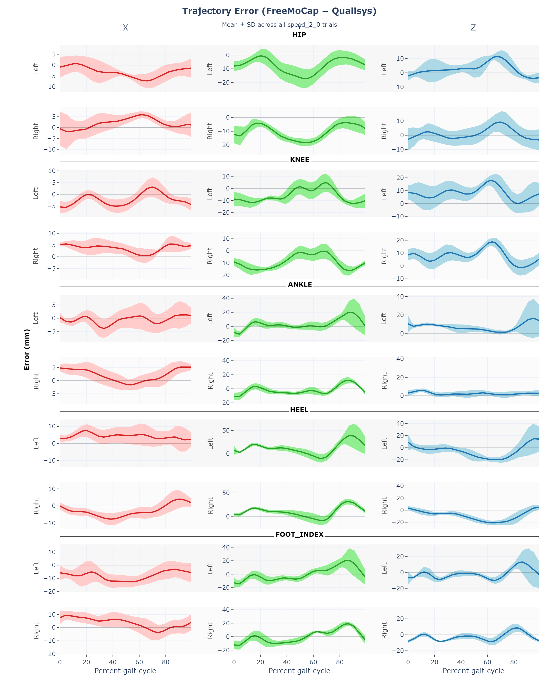
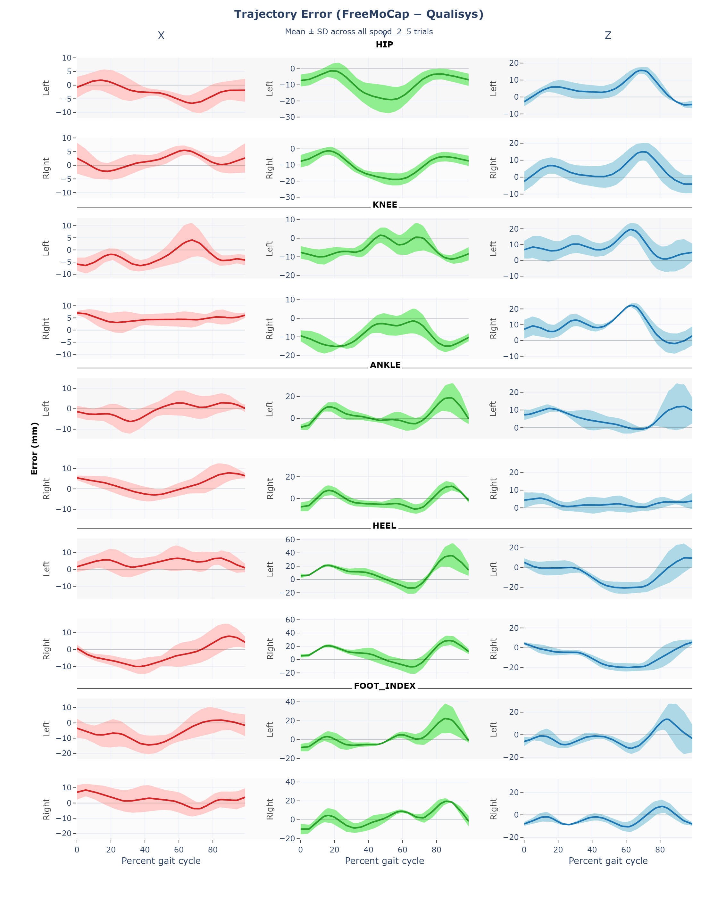
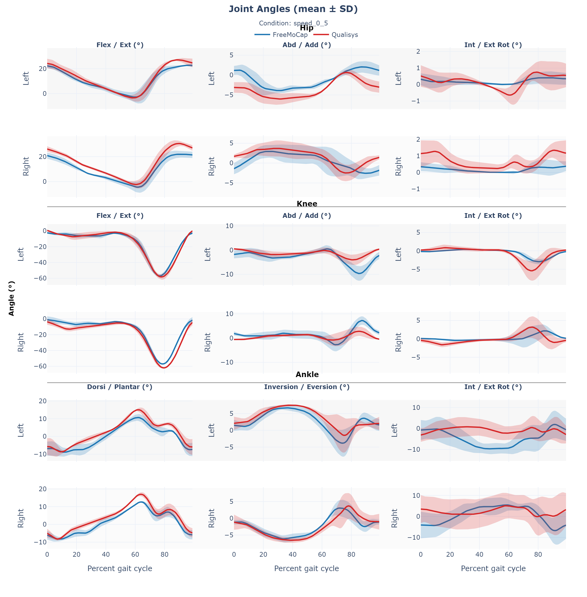
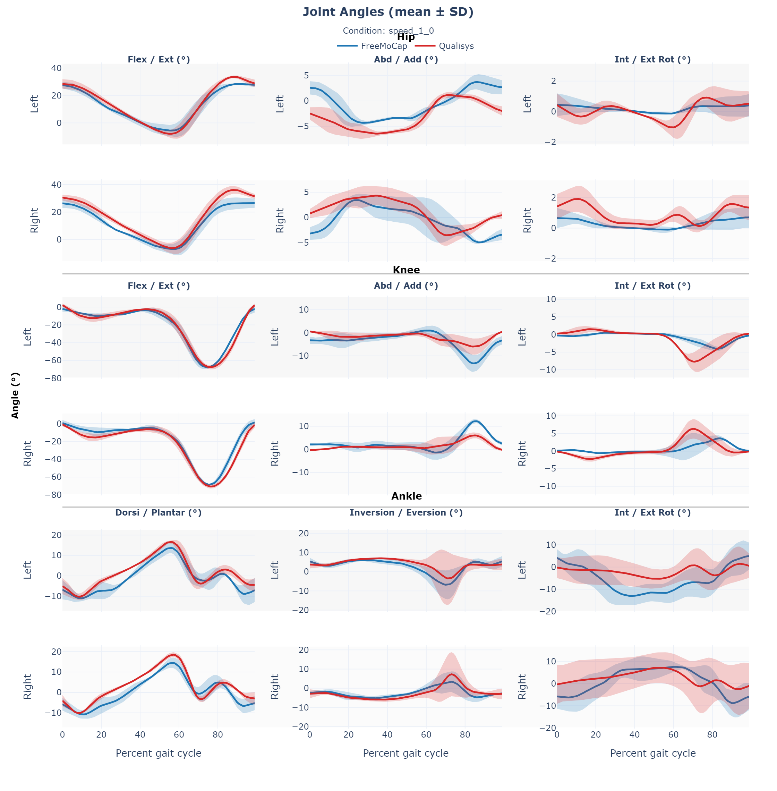
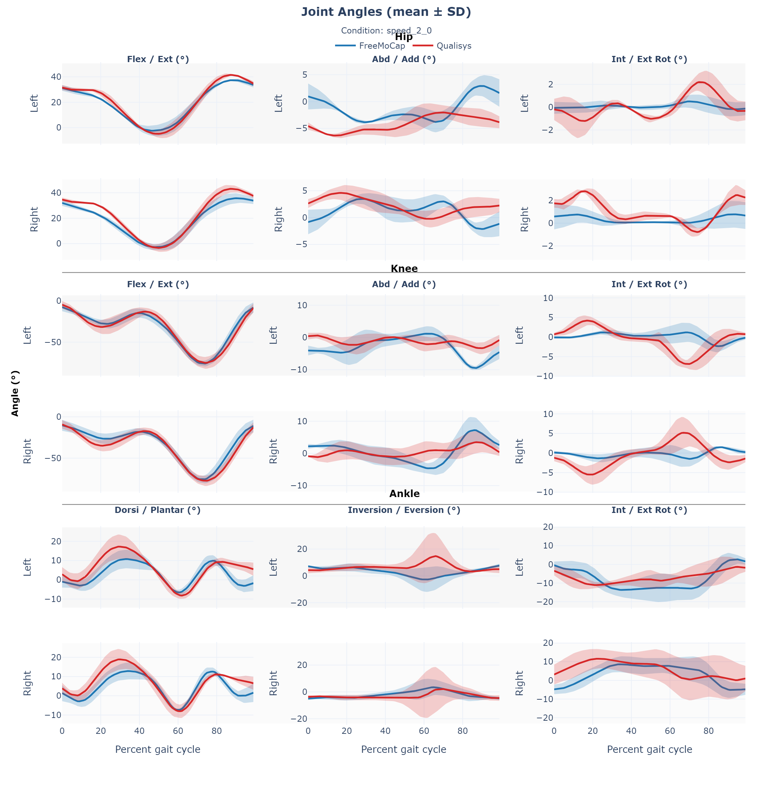

## Overview
For this part of validation, we look at the accuracy of FreeMoCap in capturing a dynamic movement, specifically gait analysis. 

## Methods
Participants were asked to walk on a treadmill, with the speed increasing in increments of .5m/s every 30 seconds - starting from 0m/s until 2.5m/s

### Tracking Patient Motion
#### Qualisys
Retroreflective markers were placed on the participant, and a Qualisys marker-based system was used to capture motion capture data

#### FreeMoCap
Six webcams were set up around the subject. Cameras were calibrated, and then used to record the patient during the SBT. 

### Data Analysis

#### Reconstructing 3D Data
Synchronized videos from the webcams were fed through the FreeMoCap software to reconstruct 3D joint centers. FreeMoCap data was smoothed using a low-pass, 4th order, 6Hz Butterworth filter. Qualisys data was downsampled and time-synchronized with FreeMoCap data. Specific frames were annotated for the start and end point of each balance condition within the recording. 1600 frames were analyzed for each condition. 

## Results
### Comparison of 3D Data Between Qualisys and MediaPipe
Take a look at a representative trial of 3D data. You can pick specific markers to look at the X, Y and Z trajectories for - with Qualisys plotted if an equivalent marker exists. 
<iframe
  src = "../skeleton_3d_plot/index.html",
  style="width:100%; height:80vh; border:none;"
  allowfullscreen
  loading="lazy">
</iframe>

### Extracting gait events
We can then use the methods from [Zeni et. all (2008)](https://pubmed.ncbi.nlm.nih.gov/17723303/) to extract heel strike and toe off from our 3D Qualisys and FreeMoCap data. 

Here's a look at that data from 50s of walking from a representative trial for both the left and right foot. 

#### Left foot gait events
<iframe
  src = "../gait_data/events/left_foot_gait_events.html",
  style="width:1200px; height:600px; border:none;"
  loading="lazy">
</iframe>

#### Right foot gait events
<iframe
  src = "../gait_data/events/right_foot_gait_events.html",
  style="width:1200px; height:600px; border:none;"
  loading="lazy">
</iframe>

### Comparing trajectories across systems
#### Normalized Trajectories
We can now look at the normalized trajectories for various markers across the gait cycle. Below is the average hip, knee, ankle, and foot markers for both MediaPipe and Qualisys for a representative participant for the .5m/s walking speed. Shaded error bars represent one standard deviation from the mean. 

<iframe
  src = "../gait_data/trajectories_mean_stride.html",
  style="width:1200px; height:1200px; border:none;"
  loading="lazy"
  scrolling = "no">
</iframe>

#### Trajectory error across speeds

Below you can flip between treadmill speeds.
Each panel shows FreeMoCap − Qualisys trajectory error (mean ± SD)
over the gait cycle.

=== "0.5 m/s"

    

    

      <a href="../gait_data/trajectory_error/trajectory_error_speed_0_5.html" target="_blank">
        Open interactive version ↗
      </a>
    

=== "1.0 m/s"

    

    

      <a href="../gait_data/trajectory_error/trajectory_error_speed_1_0.html" target="_blank">
        Open interactive version ↗
      </a>
    

=== "1.5 m/s"

    

    

      <a href="../gait_data/trajectory_error/trajectory_error_speed_1_5.html" target="_blank">
        Open interactive version ↗
      </a>
    

=== "2.0 m/s"

    

    

      <a href="../gait_data/trajectory_error/trajectory_error_speed_2_0.html" target="_blank">
        Open interactive version ↗
      </a>
    

=== "2.5 m/s"

    

    

      <a href="../gait_data/trajectory_error/trajectory_error_speed_2_5.html" target="_blank">
        Open interactive version ↗
      </a>
    

#### RMSE Per Joint Trajectory
We can also look at the RMSE per joint trajectory across speeds. 

<iframe
  src = "../gait_data/trajectory_rmse.html",
  style="width:100%; height:1400px; border:none;"
  loading="lazy"
  scrolling = "no">
</iframe>

And we can break down the RMSE data by participant data as well.

  <iframe
    src = "../gait_data/trajectory_error/rmse_boxplots.html",
    loading="lazy">
  </iframe>

### Comparing joint angles across systems
#### Normalized Joint Angles
For the same participant and speed as above, we can also look at the joint angles for the hip, knee, and ankle across the gait cycle. Shaded error bars represent one standard deviation from the mean.

<iframe
  src = "../gait_data/joint_angles_mean_stride.html",
  style="width:1200px; height:1300px; border:none;"
  loading="lazy"
  scrolling = "no">
</iframe>

#### Mean joint angles across speeds

Below you can flip between treadmill speeds.  
Each tab shows the **mean ± SD joint angles** (participant-balanced) for that condition.

=== "0.5 m/s"

    

    

      <a href="../gait_data/joint_angles/joint_angles_speed_0_5.html" target="_blank">
        Open interactive version ↗
      </a>
    

=== "1.0 m/s"

    

    

      <a href="../gait_data/joint_angles/joint_angles_speed_1_0.html" target="_blank">
        Open interactive version ↗
      </a>
    

=== "1.5 m/s"

    

    

      <a href="../gait_data/joint_angles/joint_angles_speed_1_5.html" target="_blank">
        Open interactive version ↗
      </a>
    

=== "2.0 m/s"

    

    

      <a href="../gait_data/joint_angles/joint_angles_speed_2_0.html" target="_blank">
        Open interactive version ↗
      </a>
    

=== "2.5 m/s"

    

    

      <a href="../gait_data/joint_angles/joint_angles_speed_2_5.html" target="_blank">
        Open interactive version ↗
      </a>
    
