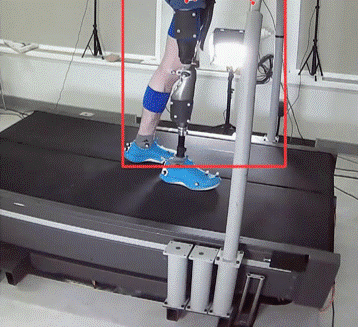
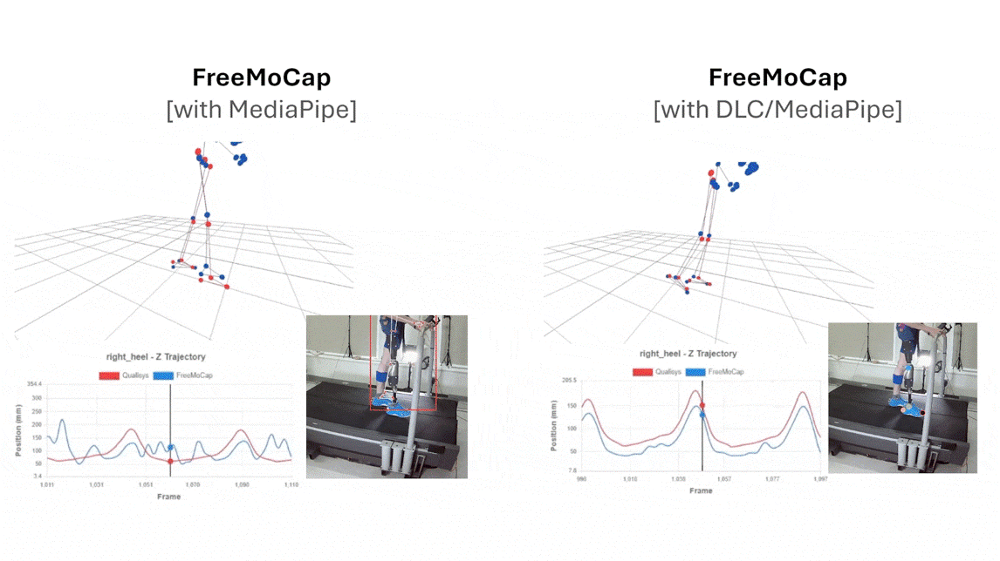

## Overview
Prosthetic alignment and fit is important to the overall health, satisfaction, and comfort of a prosthesis user. Most often, prosthetic alignment in-clinic is guided by clinician visual assessment, which may not be sensitive to to small changes in gait due to alignment. Other more sensitive tools, such as marker-based motion capture systems, may be out of scope cost and resource-wise for in-clinic use. 

Markerless motion capture represents a flexible way for clinicians to see the impact of prosthetic alignment in-clinic. One barrier to use for this purpose however, is that typical pose estimation software is trained on non-prosthetic limbs and poorly track prosthetic limbs as a result. Many markerless motion capture systems rely on a particular pose estimation software - which limits what might be suitable for this use case. Options such as DeepLabCut do provide users with ways of custom training their own pose estimation model - but requires heavy technical knowledge to operate, and still requires knowledge of 3d reconstruction and triangulation. 

FreeMoCap was designed with a modular architecture in mind - with the goal to create a framework that could allow for the use of different pose estimation software, depending on research needs. This validation utilizes a custom-made DeepLabCut wrapper to train a DLC pose estimation model on a prosthetic limb and integrates it into the FreeMoCap pipeline to look at kinematic shifts due to adjustments in alignment. 

## Methods
### Study Design
We examined one subject with a trans-femoral amputation. The subject was asked to walk for trials of one minute in length on a treadmill at a self-selected comfortable walking speed. For each trial, the subjects prosthetic alignment was adjusted in one of 3 categories, with 5 levels of adjustment from each. 

1) Changing the **leg length** of the prosthetic by +-.5/1.5 in. increments from its neutral length  
2) Changing the **ankle plantarflexion/dorsiflexion** angle by +- 2.6/5.8 degrees from its neutral angle  
3) Changing the **toe in/out** angle by +-3/6 degrees from its neutral angle.  

### Data Collection
For each trial, the subject was recorded using Qualisys, a marker-based motion capture system, and six webcams recording synchronous video through FreeMoCap software.

### Data Analysis 
#### Motion Capture Processing 
Qualisys data was processed and cleaned in QTM and exported as a TSV file. Two of the six videos were removed from final reconstruction due to heavy occlusion of the prosthetic limb. The remaining synchronized webcam videos were run through the standardFreeMoCap pipeline - providing 3D data using MediaPipe pose estimation software. 

#### DLC Training
Using a custom-made wrapper of DeepLabCut - we trained a model to track the knee, ankle, heel, and toe locations on the prosthetic. Only frames from the neutral stance videos were used in training the model. The model was run on the synchronized videos, producing 2D DeepLabCut keypoints for the prosthetic.

<table>
    <tf>
        <td> </td>
        <td> </td>
    <tr>
</table>

The 2D DLC keypoints for each video were then run through the FreeMoCap 3D reconstruction pipeline - producing 3D data for the prosthetic. This data was then spliced into the existing MediaPipe 3D data, replacing the 3D prosthetic leg data calculated by MediaPipe.

#### Data Pre-Processing
Qualisys joint centers were calculated from the exported TSV marker data. Qualisys and FreeMoCap joint center data were interpolated and then filtered using a low-pass 4th order Butterworth filter with a 7Hz cutoff frequency. The Qualisys data was temporally aligned and downsampled to match timestamps with the FreeMoCap data. FreeMoCap data was then spatially aligned with Qualisys into the lab coordinate system (X mediolateral, Y anterior-posterior, Z height)
## Results
### Leg length adjustments
Leg length was calculated as the average knee-ankle joint center length over a given trial per system using:

𝑙𝑒𝑔 𝑙𝑒𝑛𝑔𝑡ℎ= √((𝑥_1−𝑥_2 )^2+(𝑦_1−𝑦_2 )^2+(𝑧_1−𝑧_2 )^2 )  
x_1, y_1, z_1 = 3D coordinates of the ankle  
x_2, y_2, z_2 = 3D coordinates of the knee  

Below is the comparison of measured changes in leg length vs. our expected value. 

### Ankle dorsi/plantar flexion adjustments
Defined segment coordinate systems and computed relative rotation between distal/proximal segments. The relative orientation was decomposed in Z-X-Y Cardan angles. Angles were normalized using a neutral stance period. Gait events were detected using velocity zero-crossings from Qualisys data (heel strike as positive to negative, toe off as negative to positive) (Zeni, 2008) for both systems. Joint angles were then normalized by gait cycle. 

The ankle dorsi/plantarflexion angles across adjustments are visualized below for FreeMoCap on the left and Qualisys on the right. 

<iframe
  src = "../prosthetic_data/ankle_flex_ex.html",
  style="width:1200px; height:1200px; border:none;"
  loading="lazy"
  scrolling = "yes">
</iframe>

### Toe-in/Toe-out Adjustments
To track adjustments to the toe-in/toe-out of the prosthetic foot, we calculated the foot progression angle (FPA) using:

𝐹𝑃𝐴=𝑎𝑟𝑐𝑡𝑎𝑛2((𝑎𝑥𝑏)∙𝑟, 𝑎∙𝑏)  
a = long axis of the foot (vector from heel to toe)  
b = direction of walking = [0, 1, 0]  
r = unit normal to plane = [0, 0, 1]  

<iframe
  src = "../prosthetic_data/foot_progression_angle_system_comparison.html",
  style="width:1200px; height:1200px; border:none;"
  loading="lazy"
  scrolling = "yes">
</iframe>
